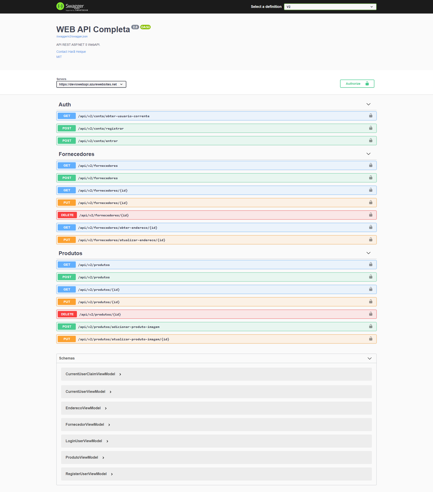

# devio-webapi-dotnet-5
Aplicação [.NET 5](https://docs.microsoft.com/pt-br/dotnet/core/dotnet-five) Web [API](https://canaltech.com.br/software/o-que-e-api/#:~:text=API%20é%20um%20conjunto%20de,Interface%20de%20Programação%20de%20Aplicativos".) utilizando a arquitetura [REST](https://becode.com.br/o-que-e-api-rest-e-restful/). Basicamente a aplicação é dividida em três camadas: **Api** (manipulação das requests e responses), **Business** (lógica de negócio) e **Data** (acesso a dados). Além disso também existem os projetos com cobertura a testes automatizados para garantia da qualidade do software.

Além disso é utilizado o [elmah.io](https://elmah.io) para capturação de erros monitoramento da aplicação a partir de requisições realizadas para as aplicações que consomem a API. Também é utilizado o [Swagger.io](https://swagger.io) para realizar a documentação e versionamento da aplicação.

<figure>
    
</figure>

Link de hospedagem da aplicação realizada na plataforma [Azure](https://azure.microsoft.com/pt-br/): https://deviowebapi.azurewebsites.net/swagger

