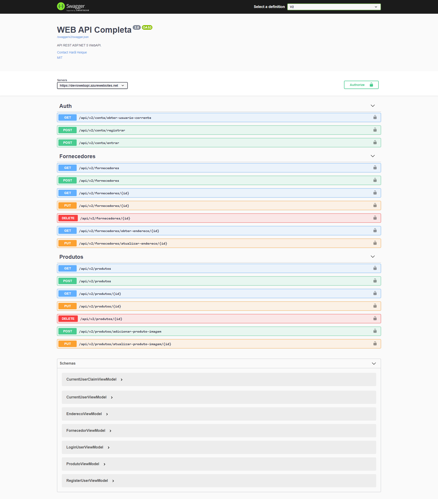

# Web API "REST" na plataforma .NET

Projeto de uma Web API REST simples implementada em .NET 9, focada em operações CRUD. Seu objetivo principal é servir como **playground para testes exploratórios**:

- Experimentação com novas ferramentas, bibliotecas e padrões de arquitetura
- Testes de estratégias de deploy em cloud (Azure)
- Validação de pipelines CI/CD
- Implementação de monitoramento e observabilidade
- Padrões de autenticação e autorização
- Versionamento e evolução de APIs
- Etc...

## Descrição Geral

A aplicação gerencia um catálogo de **Fornecedores** e **Produtos**, permitindo operações básicas de criação, leitura, atualização e exclusão de registros. Conta com autenticação via JWT, versionamento de API (v1 e v2), health checks, logging centralizado, documentação interativa via Swagger/Scalar e suporte a múltiplos bancos de dados (SQL Server e PostgreSQL). O projeto também implementa testes automatizados (unitários e de integração) com xUnit e padrões de arquitetura em camadas bem estruturados.

## Detalhes Técnicos

Aplicação [.NET 9](https://learn.microsoft.com/en-us/dotnet/core/whats-new/dotnet-9/overview) Web [API](https://canaltech.com.br/software/o-que-e-api/#:~:text=API%20é%20um%20conjunto%20de,Interface%20de%20Programação%20de%20Aplicativos".) 
utilizando as regras empregadas do estilo de arquitetura [REST](https://becode.com.br/o-que-e-api-rest-e-restful/). 
A aplicação segue uma arquitetura padrão baseada em camadas, divididas em três:

- **Api** (manipulação das requests e responses, versionamento e interface com o mundo externo);
- **Business** (lógica de negócio, validações e modelos);
- **Data** (acesso a dados via Entity Framework Core).

O projeto inclui cobertura de testes automatizados unitários e de integração para garantir a qualidade e funcionamento esperado do software.

### Stack de Tecnologias

- **Framework**: .NET 9, ASP.NET Core
- **Banco de Dados**: Entity Framework Core 9.0, SQL Server, PostgreSQL
- **Autenticação**: JWT (Bearer Tokens), ASP.NET Core Identity, OpenId Connect
- **Versionamento de API**: Asp.Versioning Mvc
- **Documentação**: Swagger/OpenAPI, Scalar
- **Logging & Observabilidade**: Serilog, Elmah.Io
- **Health Checks**: AspNetCore.HealthChecks
- **Mapeamento de Objetos**: AutoMapper
- **Testes**: xUnit, Integration Tests, TestContainers
- [Documentação .NET 9](https://learn.microsoft.com/en-us/dotnet/)
- [ASP.NET Core Docs](https://learn.microsoft.com/en-us/aspnet/core/)
- [Entity Framework Core](https://learn.microsoft.com/en-us/ef/)
- [Serilog](https://serilog.net/)
- [Swagger/OpenAPI](https://swagger.io/)
- [Docker](https://www.docker.com/)
- [Azure App Service](https://azure.microsoft.com/pt-br/services/app-service/)e
- **Deploy**: Azure App Service

<figure>
    
</figure>

Link de hospedagem da aplicação realizada na plataforma [Azure](https://azure.microsoft.com/pt-br/): 

- https://devio-api-hhhyfqeegzhdandu.brazilsouth-01.azurewebsites.net